# RP2350 + Syntiant NDP120 — Sound-Triggered Smart Home Automation Edge Node

> Ultra-low-power AI audio sensor. A cloud-connected security terminal concept that wakes and transmits only when an anomalous sound is detected. Works on USB-C power or battery.

---

<div style="text-align:center; width:80%; box-sizing:border-box;">
    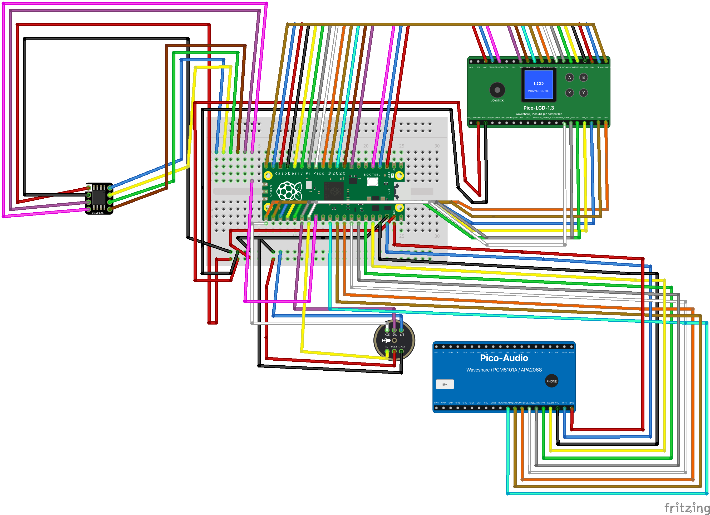
</div>


## Introduction — The Dilemma of Building a "Sound-Reactive" Device on an MCU

The RP2350 (Pico 2 W) is a $7-class MCU, yet combining PIO I2S, DMA, dual-core isolation, and Opus compression enables a real-time audio terminal with always-on Wi-Fi + TLS. It captures audio via an I2S MEMS microphone (INMP441), encodes it to Opus at 16 kbps, and streams it to the cloud — a 93.75% bandwidth reduction compared to raw PCM.

However, when you only want to transmit when a specific sound occurs, an MCU alone (without NDP120) hits a wall.

| Option | Problem |
|---|---|
| **Always-on cloud streaming** | Enormous bandwidth and power. Battery operation is impractical |
| **Edge VAD / audio classification** | Requires SBC (Raspberry Pi, etc.) level compute. Not feasible on an MCU. SBCs consume too much power |

MCUs offer great power efficiency but can't classify sounds. SBCs can classify but are power-hungry. **Low power and edge audio classification are mutually exclusive.**

The **Syntiant NDP120 Neural Decision Processor** resolves this dilemma. It runs a custom DNN continuously on dedicated neural processing silicon, keeping audio classification entirely on the edge. Power consumption is in the µW–low mW range. It's controlled directly via SPI from the RP2350, giving you **MCU-level power consumption with full edge audio classification**.

This configuration is called **Audio Sentinel** — an ultra-low-power, compact, cloud-connected audio event security node.

---

## Why NDP120 Pairs So Well with RP2350

The RP2350's audio pipeline maps directly onto the NDP120 backend.

| RP2350 Component | Role After Adding NDP120 |
|---|---|
| PIO SPI master | Direct NDP120 control, match result retrieval, PCM extraction |
| Opus 16 kbps (93.75% reduction vs PCM) | Transmit only on detection — further slashes bandwidth and power |
| TLS always-on (CYW43 Wi-Fi) | Immediate cloud delivery of detection events + audio |
| Cloud relay (minimal, no GPU/CDN) | Backend for notifications and audit trail storage |
| BLE provisioning | Wi-Fi setup from smartphone |
| LCD + button UI | Detection status display and sensitivity adjustment |

---

## What Is the Syntiant NDP120?

Syntiant's Neural Decision Processor. It natively runs CNN/RNN/FC networks on dedicated AI silicon (Syntiant Core 2) to classify audio and sensor data in real time. This is fundamentally different from running inference on a general-purpose MCU/SBC — **the inference itself is optimized at the silicon level**.

### Example Detectable Events

| Category | Detected Sound |
|---|---|
| **Security** | Glass breaking, gunshots, door forced open |
| **Fire / Safety** | Fire alarms (T3/T4), smoke detector alerts |
| **Elder care** | Baby crying, screaming, fall sounds |
| **Daily life** | Snoring, coughing, microwave end tone |
| **Pets** | Dog barking, cat meowing |

DNN models can be loaded chunk-by-chunk via SPI using `syntiant_ndp120_tiny_load()`, enabling OTA model updates.

**Key characteristics:**

- **Dedicated AI silicon** — Custom silicon built for neural inference, not a general-purpose processor
- **Ultra-low power** — Always-on inference in the µW–low mW range. Designed for battery operation
- **SPI interface** — Direct register access from RP2350's PIO SPI master. Not UART + AT commands; uses `get_match_summary()` / `extract_data()` / `poll()` for low-latency control
- **Integrated digital mic support** — NDP120 can process PDM mic input directly. External mics can also supply PCM via SPI

---

## Core Isolation

<div style="text-align:center; width:80%; box-sizing:border-box;">
    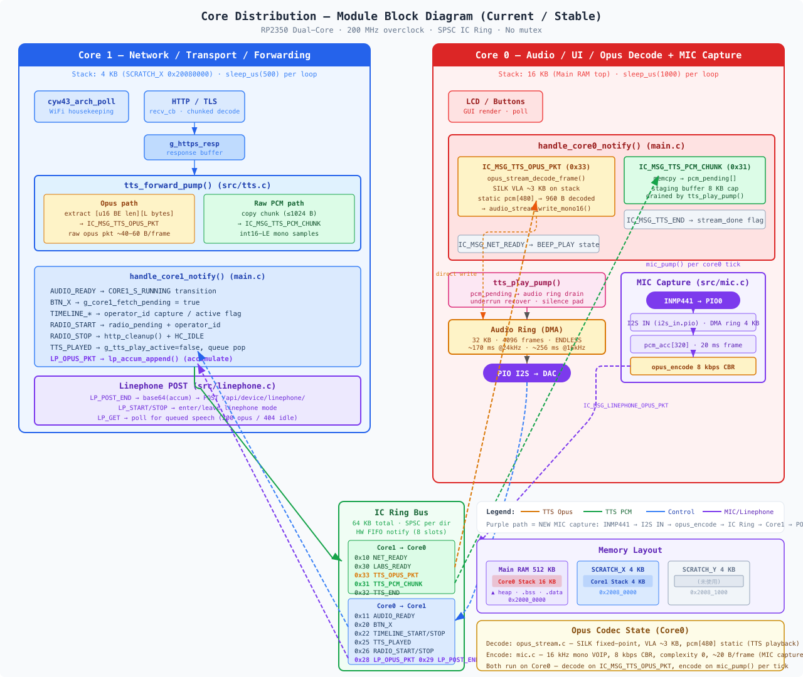
</div>


## System Architecture

<div style="text-align:center; width:80%; box-sizing:border-box;">
    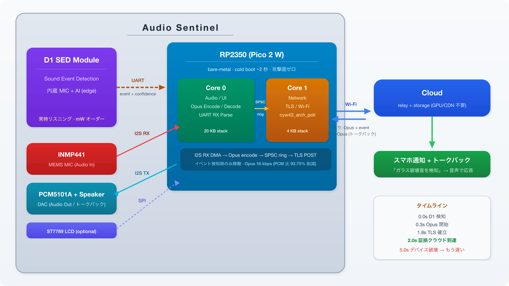
</div>

### Operation Flow

<div style="text-align:center; width:80%; box-sizing:border-box;">
    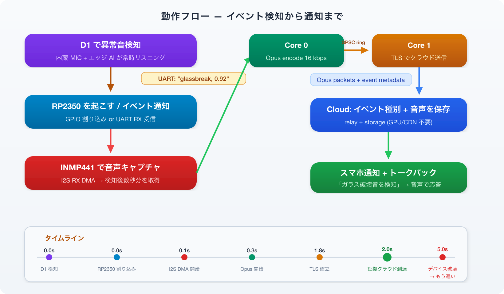
</div>

**NDP120 decides _when_, and RP2350 decides _what_ to send.** The responsibilities are completely separated.

---

## RP2350 — NDP120 Connection

The NDP120 operates as an SPI slave; the RP2350 acts as the SPI master.

| NDP120 Pin | RP2350 Pin | Role |
|---|---|---|
| SPI_CLK | PIO SPI CLK | SPI clock |
| SPI_MOSI | PIO SPI TX | Command / model data transmission |
| SPI_MISO | PIO SPI RX | Match result / PCM data reception |
| SPI_CS | GPIO (CS) | Chip select |
| INT | GPIO (wake input) | Match detection interrupt — dormant wake trigger |
| GND | GND | |
| 3.3V | 3.3V | |

When the NDP120 detects an audio event, it fires an interrupt on the **INT pin**. The RP2350 wakes instantly from dormant mode on this GPIO interrupt and calls `get_match_summary()` over SPI to retrieve the detection result.

```c
// RP2350 processing flow (bare-metal)
// 1. Wake from dormant on INT interrupt
// 2. Retrieve match result via SPI
syntiant_ndp120_tiny_poll(ndp, &notifications, 1);
syntiant_ndp120_tiny_get_match_summary(ndp, &summary);
// 3. Extract PCM from NDP120 built-in mic via SPI
syntiant_ndp120_tiny_extract_data(ndp, pcm_buf, &len);
// 4. Append PCM to Flash via mxfs (held until TLS is established)
// 5. Opus encode → SPSC ring → Core 1 → TLS send
```

---

## Why This Architecture Makes Sense

### Comparison with Existing Approaches

There are two realistic configurations for audio event detection devices.

| | SBC + VAD + Edge Inference | SBC + VAD + Cloud Inference | **NDP120 + MCU (this design)** |
|---|---|---|---|
| **Edge HW** | Raspberry Pi etc. (a few W) | Raspberry Pi etc. (a few W) | **NDP120 (µW–low mW) + RP2350 (dormant)** |
| **Edge processing** | VAD + audio classification model | VAD only | **NDP120 handles it all on dedicated silicon** |
| **Cloud load** | Relay only | Inference server always running (CPU/GPU) | **Relay only** |
| **Transmission timing** | After inference, when needed | On VAD trigger (includes false positives) | **NDP120 match only** |
| **Idle power** | A few W (Linux always running) | A few W (Linux always running) | **µW–low mW (battery-feasible)** |
| **Cost** | SBC $35–75 + PSU | SBC + cloud inference server | **MCU $7 + NDP120** |
| **Boot time** | 30–60 s | 30–60 s | **~2 s** |

SBC-based designs require Linux running continuously for VAD or edge inference, pushing idle power to several watts. When relying on cloud inference, VAD false positives are uploaded and inference server costs accumulate.

NDP120 + MCU **handles edge audio classification entirely on dedicated silicon at µW–low mW, keeps the MCU in dormant, and uses the cloud only for relay** — minimizing all three layers simultaneously.

### Privacy by Design

- NDP120 edge AI determines only the sound _type_ — conversation content never reaches the cloud
- Audio is transmitted only for a few seconds after detection — not continuously
- The cloud is relay + storage only — no inference server, no speech recognition required

### Ultra-Lightweight Second Filter on MCU — Reject False Positives Before Waking Wi-Fi

Rather than sending every NDP120 match directly to the cloud, a very lightweight filter runs on the RP2350. **If a false positive can be dropped before waking Wi-Fi/TLS, the battery cost is essentially zero**.

<div style="text-align:center; width:80%; box-sizing:border-box;">
    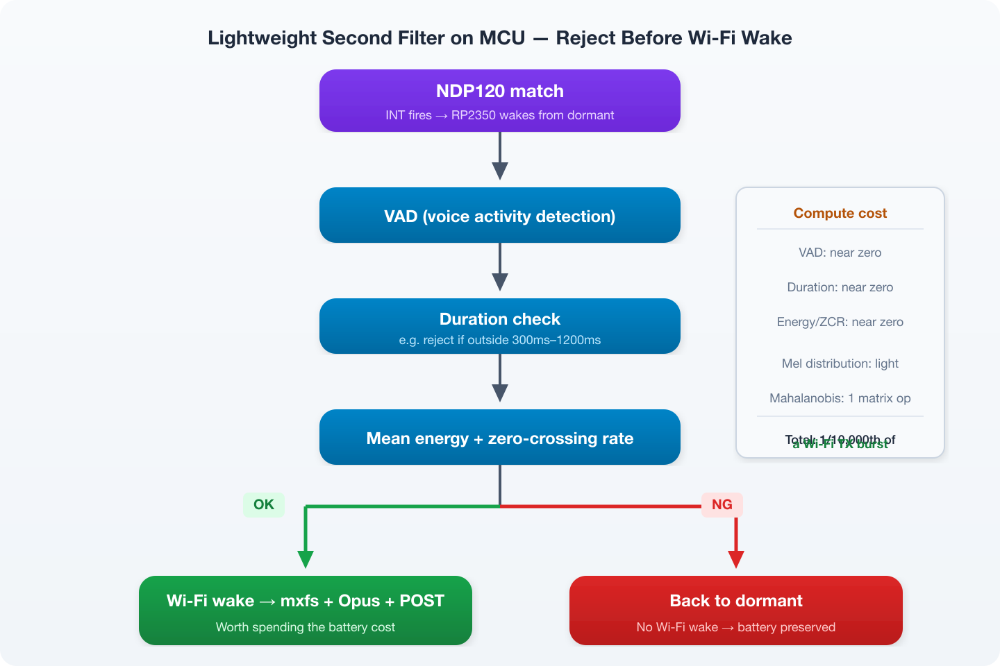
</div>

Compute cost and effectiveness of each filter:

| Filter | Compute cost | What it rejects |
|---|---|---|
| **Post-VAD utterance length** | Near zero | Impulses too short (< 100 ms), continuous ambient sounds too long (> 3 s) |
| **Mean energy** | Near zero | Low-energy ambient noise |
| **Zero-crossing rate** | Near zero | Non-voice impulse sounds (door slams, dishes, etc.) |
| **Mel energy distribution** | Lightweight | Coughs, mechanical sounds with different distributions from human voice |
| **Mahalanobis distance** | Lightweight (one matrix op) | Outliers from training-time statistics |

The most cost-effective combination is **post-VAD utterance length + mean Mel energy distribution**. During training, save mean utterance length, mean Mel vector, and covariance from 100 samples of the target sound event. At runtime, compute Mahalanobis distance once. This rejects most false positives at a fraction of the compute cost of cloud inference like Whisper.

**For battery-powered operation, this filter is critical.** Every false NDP120 match triggers Wi-Fi TX (~300 mA × several seconds). Eliminating 10 false positives per day visibly extends battery life.

### Instant Wake — Detection to Transmission in Under 2 Seconds

Structurally impossible on an SBC (Raspberry Pi / Jetson).

| | RP2350 (MCU) | Raspberry Pi (SBC) |
|---|---|---|
| **Cold boot → first transmission** | **~2 s** | 30–60 s |
| **Breakdown** | PIO I2S init < 1 ms, Wi-Fi associate ~1.5 s, TLS handshake ~0.3 s | Linux kernel boot 15 s, systemd services 10 s, Wi-Fi dhclient 5 s, Python runtime 3 s, TLS 1 s |
| **OS** | None (bare-metal) | Linux (kernel + init + daemons) |
| **Filesystem** | None (Flash XIP) | SD card mount + fsck |
| **Attack surface** | None | SSH, OS vulnerabilities, SD card removal |

**What happens in a security scenario:**

<div style="text-align:center; width:80%; box-sizing:border-box;">
    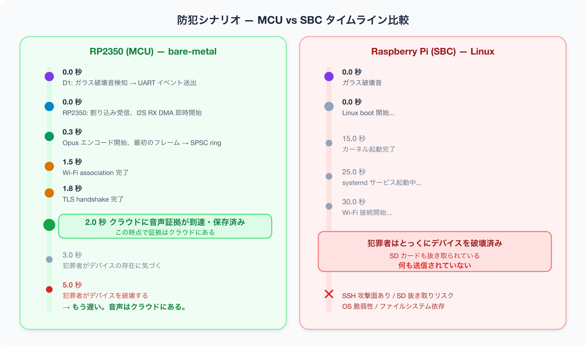
</div>

**MCU bare-metal boot is a security feature.** The absence of an OS is not a limitation — it is an advantage for a security device. No bootloader, no filesystem, no init process — code runs the instant power is applied. Zero attack surface: no SSH port, no shell.

**Never Miss Post-Detection Audio — PCM Buffering with mxfs**

There is approximately 1.8 seconds between NDP120 firing a match and TLS being established. The PCM captured by NDP120's built-in mic during this window is the most critical audio (glass breaking, screaming, intrusion sounds), but SRAM budget makes long-duration buffering difficult.

[mxfs](https://github.com/xander-jp/mxfs) — a bare-metal append-only log-structured filesystem (≤10 KB RAM, ~1 KB code) — immediately appends PCM extracted from the NDP120 via SPI using `extract_data()` to SPI Flash. After TLS is established, PCM is read from Flash, Opus-encoded, and sent to the cloud.

<div style="text-align:center; width:80%; box-sizing:border-box;">
    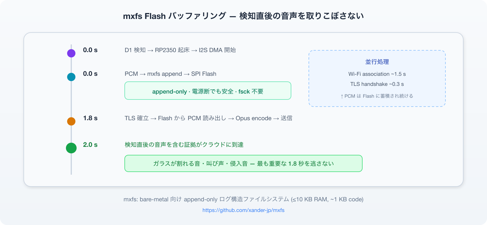
</div>

mxfs is append-only and power-loss tolerant, so data remains intact even on sudden power loss during battery operation. No fsck required.

Furthermore, the NDP120's INT pin enables waking the RP2350 from dormant mode. NDP120 is always powered and always inferring; when a match is detected it fires INT → RP2350 wakes instantly from dormant on the GPIO interrupt. NDP120's always-on power consumption is in the µW–low mW range, making **battery operation practical**.

**Example Battery Configuration: Eneloop AA × 2 + Boost + Decoupling**

| State | Current (3.3V side) | Time ratio |
|---|---|---|
| Standby (NDP120 always-on inference + RP2350 dormant + CYW43 powered off) | ~hundreds of µA | 99.9% |
| Event firing (RP2350 wake + CYW43 Wi-Fi TX) | ~300 mA peak | a few seconds per event |

NDP120 always-on inference is in the µW–low mW range. CYW43 Wi-Fi TX peaks at ~300 mA, but events fire only a few times per day for a few seconds each. Steady-state draw from the battery stays well under ~1 mA.

<div style="text-align:center; width:80%; box-sizing:border-box;">
    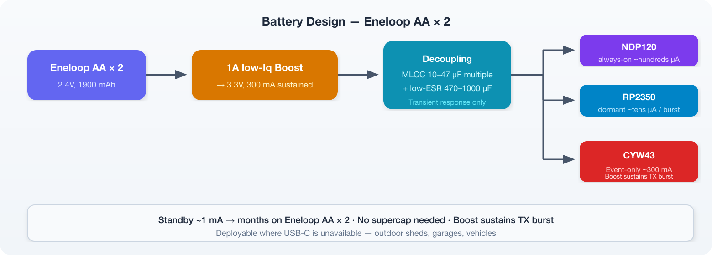
</div>

The RT6154 buck-boost SMPS on the Pico 2 W board (input 1.8–5.5V) + decoupling capacitors continuously supply the 300 mA Wi-Fi TX peak. Just connect Eneloop 2.4V to the VSYS pin.

### Bidirectional — Send Your Voice to the Scene from Your Phone

The RP2350 includes a downlink audio playback path via PIO I2S TX + PCM5101A DAC + speaker. This means instead of one-way detection → notification, you get **a bidirectional intercom where you can speak from your phone to the scene**.

<div style="text-align:center; width:80%; box-sizing:border-box;">
    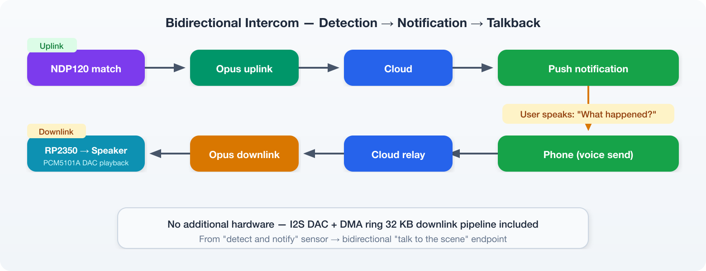
</div>

The phone side can initiate talkback the instant a notification is received. No additional hardware is required on the device side — the I2S DAC and a 32 KB DMA ring downlink playback pipeline are already part of the design.

**Use cases:**

| Scene | Response from phone |
|---|---|
| Elder care — fall sound detected | "Are you OK?" |
| Security — glass breaking detected | "Police have been notified" (as a deterrent) |
| Pet care — dog barking continuously | Calm the dog with the owner's voice |
| Entrance — door open/close detected | Auto-play "Welcome home" |

### Near-Zero Cloud Cost

The cloud side is designed as a minimal relay-centric configuration with no GPU or CDN. NDP120 + RP2350 sends only event-driven Opus packets of a few seconds each, so cloud load is nearly zero. Talkback from the phone also only relays Opus downlink packets — no additional server resources required.

---

## Smart Home Automation Use Cases

| Category | NDP120 Detection | RP2350 Action | Cloud → User |
|---|---|---|---|
| **Entrance monitoring** | Glass breaking | Send 5 s Opus post-detection | "Anomalous sound detected at entrance" + audio playback |
| | Door open/close | Send event log | Arrival notification |
| | Metal impact | Opus + high priority flag | Immediate smartphone alert |
| | | | |
| **Elder care** | Cry for help | Send 10 s Opus post-detection | Emergency alert + audio review |
| | Fall sound | Event + audio send | "Possible fall detected" |
| | Long silence | Silence timeout notification | "No sound detected for 2 hours" |
| | | | |
| **Security** | Window breaking | Send Opus + alert | Immediate smartphone alert |
| | Suspicious footsteps | Event log | Timeline record |
| | Gunshot | Highest-priority send | Emergency dispatch integration |
| | | | |
| **Pet care** | Dog barking (continuous) | Record and send Opus | "Dog has been barking for over 5 minutes" |
| | Cat meowing (abnormal) | Event + audio | Possible health issue notification |
| | | | |
| **Appliance integration** | Microwave end tone | Event notification | Smartphone alert "Microwave done" |
| | Washing machine end tone | Event notification | "Laundry is finished" |
| | Fire alarm (T3/T4) | High-priority alert + Opus | All lights on + emergency notification |

---

## NDP120 Integration into the Dual-Core Architecture

How NDP120 fits into the fully isolated audio pipeline across RP2350's two cores.

| | Core 0 (20 KB stack) | Core 1 (4 KB stack) |
|---|---|---|
| **Role** | Audio / UI / Opus Encode & Decode | Network / Transport / Forwarding |
| **Stack placement** | Main RAM top + SCRATCH_X (merged) | SCRATCH_Y |
| **Heavy workload** | opus_encode (SILK VLA peak 18.9 KB) | TLS handshake / cyw43_arch_poll |
| **Loop cadence** | 1 ms | 500 µs |

Inter-core communication uses a **64 KB SPSC ring buffer + HW FIFO notify (8 slot)**. Backpressure cascades automatically: audio ring at 75% fill → IC dequeue stops → IC ring fills → ic_send_avail==0 → forward_pump skips → g_https_resp fills → recv_cb ERR_MEM → TCP window closes.

### Audio Pipeline — Asymmetric Uplink/Downlink Design

Uplink and downlink have **independent DMA rings with asymmetric sizes, directions, and buffering strategies**.

<div style="text-align:center; width:80%; box-sizing:border-box;">
    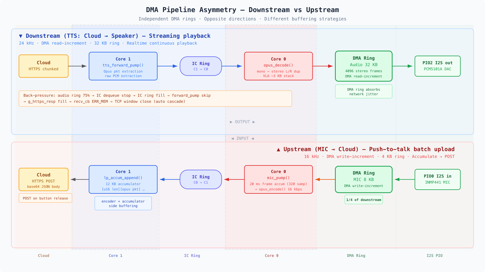
</div>

Downlink uses a large DMA ring (32 KB) to absorb jitter for real-time continuous talkback playback. Uplink uses a minimal ring (4 KB) for batched transmission on event detection, with buffering handled by the encoder and accumulator. Different use cases — no reason to make them symmetric.

### SRAM Layout — The 520 KB Zero-Sum Game

<div style="text-align:center; width:80%; box-sizing:border-box;">
    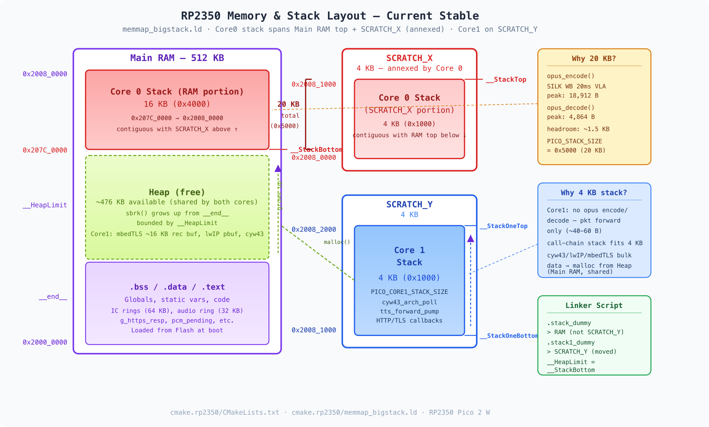
</div>

Beyond the 512 KB Main RAM, the RP2350 has SCRATCH_X / SCRATCH_Y (4 KB × 2). The Opus encoder's SILK VLA expands the stack to **18,912 B** during an `opus_encode` call — far exceeding the SDK default of 4 KB.

The custom linker script `memmap_bigstack.ld` relocates Core 0's stack to the top of Main RAM and merges the physically adjacent SCRATCH_X, securing **20 KB** — **without cutting into the heap at all**. Core 1 is moved to SCRATCH_Y (4 KB). In a 520 KB MCU, stack, heap, and BSS are a zero-sum game; this layout was arrived at by simultaneously measuring canary-paint, sbrk(0), and opus_get_size.

### NDP120 Integration into Core 0

<div style="text-align:center; width:80%; box-sizing:border-box;">
    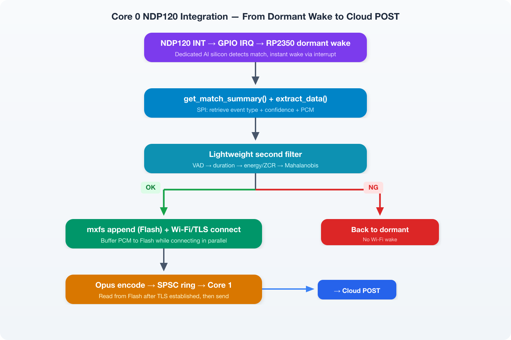
</div>

NDP120's INT wakes the MCU from dormant; match results and PCM are fetched via SPI. **Before waking Wi-Fi**, a lightweight filter evaluates for false positives — on NG, dormant is re-entered immediately. Only on OK are the mxfs + Wi-Fi/TLS costs incurred.

1. INT fires → wake from dormant, retrieve detection event via `poll()` + `get_match_summary()`
2. Fetch PCM from NDP120 built-in mic via SPI with `extract_data()`
3. **Lightweight filter**: VAD → utterance length check → mean energy/ZCR → Mahalanobis distance. On NG, return to dormant
4. OK → append PCM to Flash via mxfs, Wi-Fi association + TLS handshake (in parallel)
5. After TLS established, read PCM from Flash and Opus-encode
6. Attach event metadata (type + confidence + timestamp), forward to Core 1 via SPSC ring

### Core 1 Unchanged

Core 1 is dedicated to Network / Transport. It pulls data from the SPSC ring and sends it over TLS — this behavior is identical whether operating always-on or event-driven. **Core 1's code is the same for both always-on and event-driven modes.** The downlink talkback path (Cloud → Opus decode → DAC) is also processed through the same downlink pipeline.

### Memory Impact of Adding NDP120

| Added component | Cost |
|---|---|
| syntiant_ndp120_tiny driver | ~2–3 KB (Flash + BSS) |
| SPI TX/RX buffer | ~256 B (BSS) |

**~3 KB added** against a 520 KB SRAM budget — easily absorbed by heap headroom. NDP120's DNN model is stored in NDP120's own on-chip memory and does not consume RP2350 SRAM. Opus encoder/decoder, DMA ring, SPSC ring, and TLS buffers are all within the SRAM layout described above.

---

## Summary

All the pieces are in place:

- **Detection** — NDP120 dedicated AI silicon (µW–low mW)
- **Uplink** — NDP120 built-in mic → SPI PCM extraction → Opus encode → Cloud (93.75% bandwidth reduction)
- **Downlink** — Cloud → Opus decode → PCM5101A DAC → speaker (talkback)
- **Transport** — TLS always-on (CYW43)
- **Cloud** — Relay only (no GPU/CDN required)
- **Notifications** — Smartphone push notifications
- **Setup** — BLE zero-touch provisioning

---

## Technical Stack (NDP120 Configuration)

| Layer | What | Why |
|---|---|---|
| MCU | RP2350 dual-core 200 MHz | $7-class, capable of real-time Opus encode |
| Neural Decision Processor | Syntiant NDP120 | Dedicated AI silicon, always-on audio classification, µW–low mW |
| NDP120 ↔ RP2350 | PIO SPI (master/slave) | Direct register access, match notification, PCM extraction |
| Wi-Fi | CYW43 (Pico 2 W) | TLS connection on events only |
| TLS | mbedTLS | HTTPS / WSS |
| Codec (encode) | Opus (SILK fixed-point) 16 kHz mono 16 kbps | Compressed audio transmission to cloud on event detection |
| Codec (decode) | Opus (SILK fixed-point) 24 kHz mono | Cloud → MCU talkback playback |
| Audio In | NDP120 built-in PDM mic (PCM extraction via SPI) | No external microphone required |
| Audio Out | PIO I2S TX → PCM5101A DAC + speaker | 32 KB DMA ring, smartphone talkback playback |
| Flash Buffer | mxfs on SPI Flash | PCM retention from detection to TLS establishment, power-loss tolerant |
| IC Bus | SPSC ring + HW FIFO | Lock-free, zero-copy |
| Provisioning | BLE (BTstack) | Zero-touch setup via iOS app |
| Display | ST7789 1.3" LCD (optional) | Detection status display |
| Power | USB-C 5V / Eneloop AA×2 + 1A-class low-Iq boost + MLCC/low-ESR cap | Mains or battery operation (several months) |
